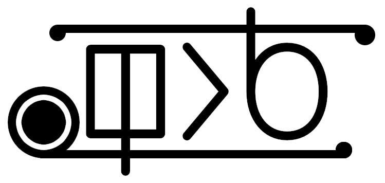

**!!o sona!!:** tenpo pi ni en kama la mi pali ala e pali ni li pona ala e pali ni.

# **ilo li sina**

ilo tawa lawa e ilo nanpa kepeken toki "ilo li sina". toki "ilo li sina" li toki
pi lawa e ilo nanpa li kepeken e nimi wawa GOTO li lawa e nimi wawa lon nasin
pona li kepeken e jan tawa nanpa e nanpa li kepeken taso e poki nimi li tawa ilo
nanpa pi wile pi pali ala en awen lon tomo. ;)

"ilo li sina" li toki musi (jan pi toki Inli li kepeken e nimi "esoteric" tawa
toki sama ni). ona li tawa ala pali suli. ona li tawa musi.

ali lon toki ni li nimi. sina ken kepeken e nimi taso.

sina wile kama sona e nasin kepeken pi toki ni la o lukin e `nasin_kepeken.md`.

## **nasin pali**

sina wile e ilo CMake en Python pi nanpa 3 en ilo Ncurses anu ijo ante pi pana
pi ilo Terminfo lon ilo nanpa sina. sina ken kama jo e ona kepeken lipu
`shell.nix` kepeken nimi ilo `nix-shell`.

ilo pali C++ sina li wile ken pali e C++11 anu suli tawa C++11.

o tawa lon poki lipu "ilo li sina" o toki e nimi wawa ni tawa pali e lipu wawa
pini:

```console
cmake .
cmake --build .
```

ona li kama lon poki li jo e nimi "ilo_li_sina".

## **nasin pi pana e lipu wawa lon ilo nanpa sina**

sina ken pona kepeken e lipu "ilo_li_sina" kepeken ala ante.

sin la sina ken kama jo e ona kepeken ilo Nix tan poki NUR
(https://github.com/nix-community/NUR) kepeken nimi ni:

```nix
nur.repos.ona-li-toki-e-jan-Epiphany-tawa-mi.ilo-li-sina
```

## **lipu wawa pi pana toki**

sina ken alasa e lipu wawa pana lon poki "lipu_pana".

## **pali e ante toki sin**

sina wile pali e ante toki pi toki sin la o pali e lipu pi pini ".lang" lon poki
"nimi_en_toki".

nimi pi lipu ni li nimi nanpa toki (sama "en_US.lang" tawa toki Inli pi ma
Mewika anu "ru_RU.lang" tawa toki Losi). nimi la o sitelen e nimi toki kepeken
sitelen lili (pana la "en") e sitelen '\_' e nimi ma pi toki ni kepeken sitelen
suli (pana la "US"). toki li jo ala e ma (sama toki pona, "tok") la o sitelen e nimi toki taso.

o pana e nimi tan ante toki ante (lipu "tok.lang" li pona pona) lon lipu ni.
nimi pi ante toki li tu kepeken sitelen '='. o ante ala e nimi pi nanpa 1. ona
li tawa nimi wawa. o ante e nimi pi nanpa 2 lon monsi pi sitelen '=' lon toki
sina. o pali e wile PR pi wan e ante.

ilo ni li kepeken e poki nanpa LANG pi lawa OS tawa kama jo e toki wile. sina
ken ante e ona tawa ni: ilo li toki ala lon toki sina la ona li kama toki ona.

## **lupa tawa lipu ante**

sitelen tawa pana:<br>
https://odysee.com/toki-nasa-lili-mi-ilo-li-sina-pi-lawa-e-ilo-nanpa:54b96d2ce3e6ab4cde57a4522a8ac90c8a140796?r=HYroMZaqrVN4gL5oSJ35gcTgt3K56r39
