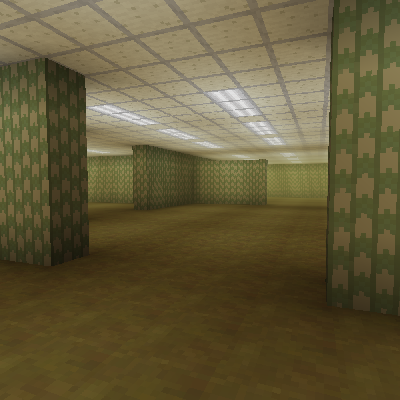
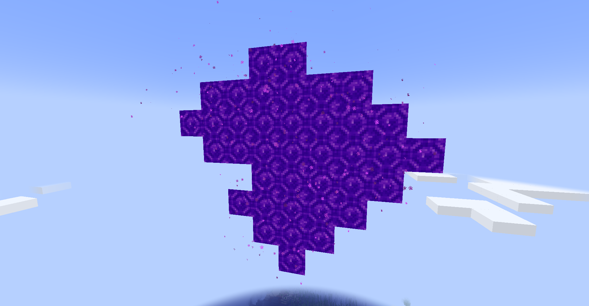
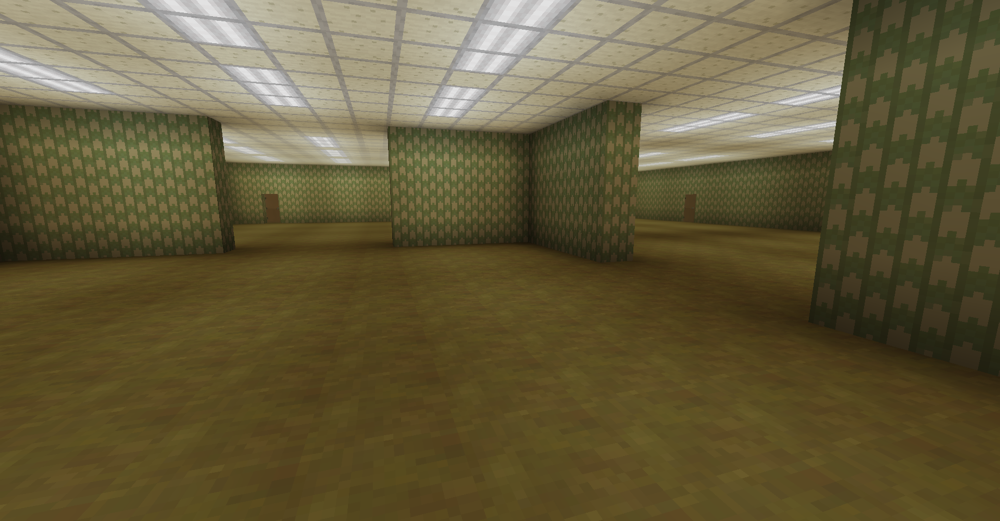
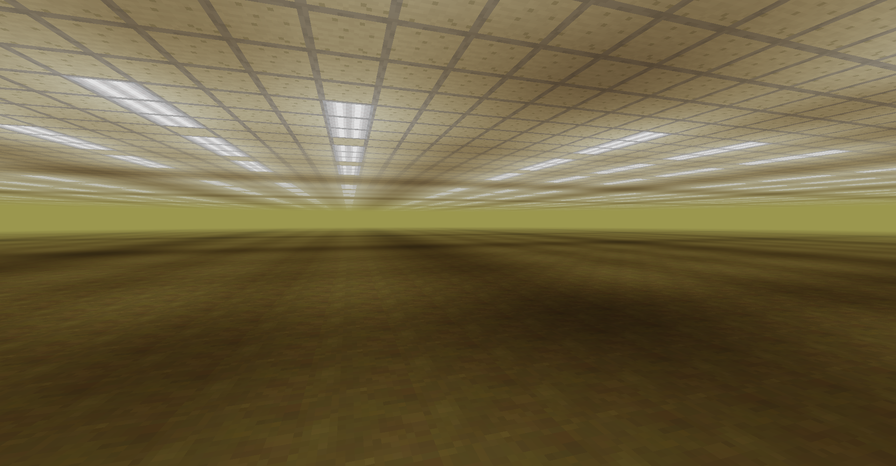
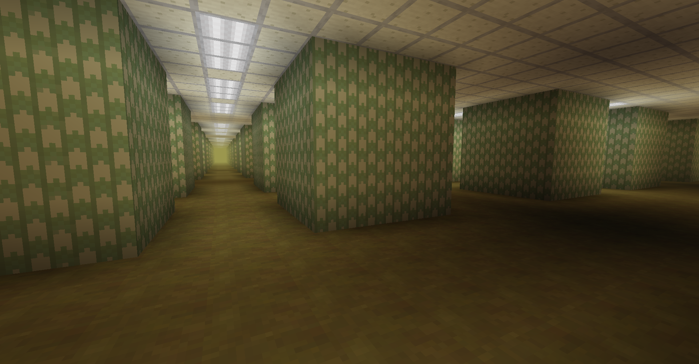
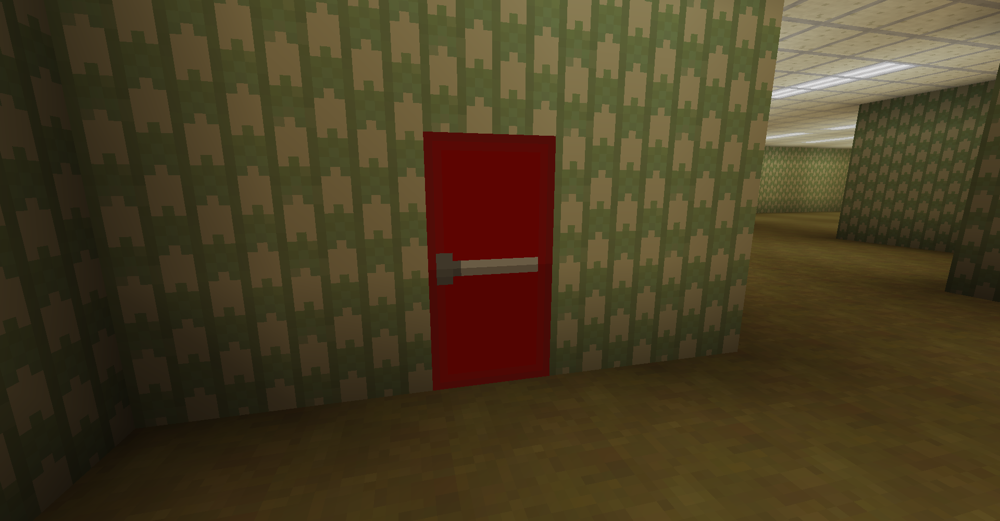
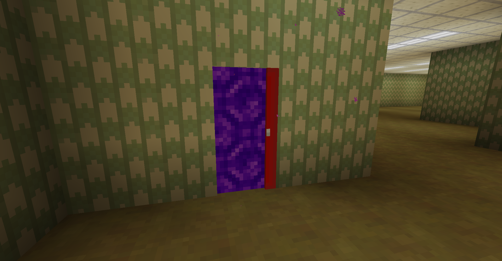

# Modular Backrooms

Modular Backrooms is a mod for Mineraft that adds the Backrooms. The idea being
that when you generate the world you can choose what kind of experience you'd
like to have.

At the moment, only Classic mode is implemented, which includes only Level 0,
the infinite maze of office rooms and moist carpet.

You can enter either by dying in the void (you'll keep your items,) or by
finding one of the rifts that naturally generate in all dimensions.

To leave, you will need to locate either a red exit door or another rift.

## Roadmap

The other two modes that I will add will be Extended Liminal and Nightmare.
Extended Liminal will include most of the levels but stick to the liminal theme,
i.e. no liver monster that you need to pray to with 3 human wax candles and a
jug of almond flavored water every odd hour to prevent it from stealing half of
your liver through the 4th dimension to add to a life-size statue of itself or
something. Nightmare will have such things.

I'm also planning to add the ability to create the "Threshold" (backrooms
portal) as shown in Kane Pixel's backrooms universe along with destroyed labs
and other structures to the overworld to explore.

However, keep in mind that I may simply abandon this project and never look it's
way again ;).

## Installation

You will need to use the Fabric Modloader (https://fabricmc.net/use/installer).

You will also need to install the following dependency(ies):
- Fabric API - https://www.curseforge.com/minecraft/mc-mods/fabric-api

After that, grab a version from the releases tab
(https://github.com/ona-li-toki-e-jan-Epiphany-tawa-mi/Survival-Command-Blocks/releases)

## How to build

Java 17 or higher is required.

First, follow these instructions on the Fabric Wiki to get the development
enviroment setup: https://fabricmc.net/wiki/tutorial:setup

After that, run the following command inside the project directory:

```console
./gradlew build
```

If on Windows instead of a POSIX system, run this instead:

```console
gradlew.bat build
```

The complied jar file should appear in `build/libs/`.

## Screenshots







