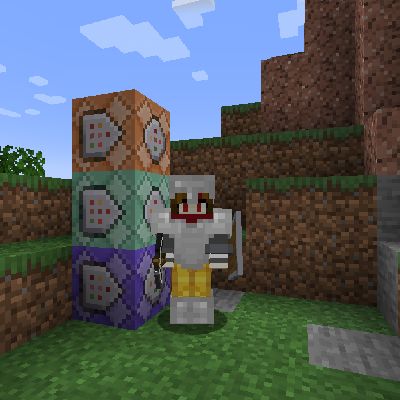
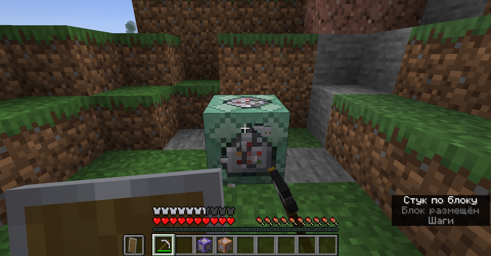
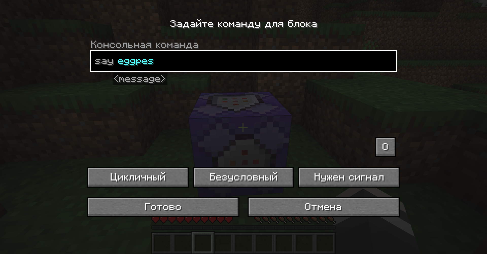
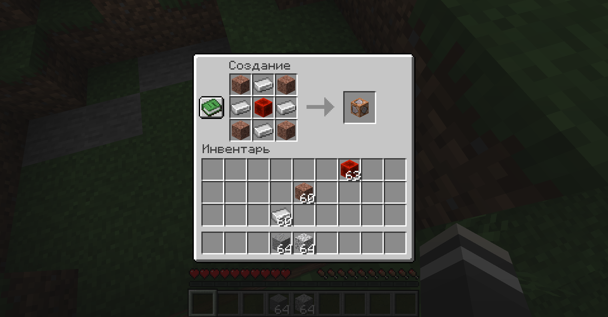
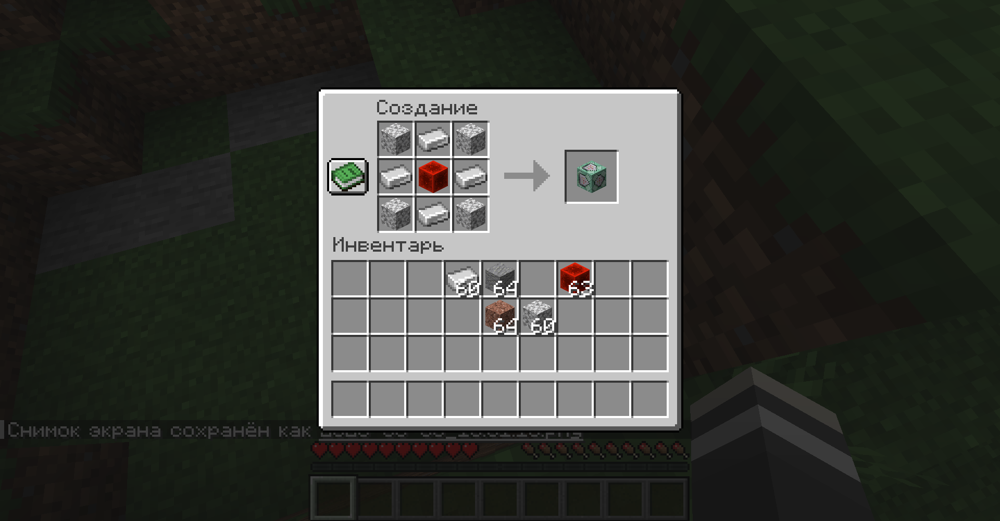
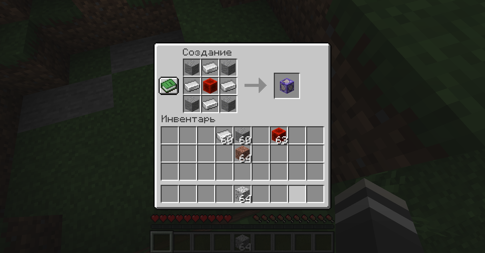
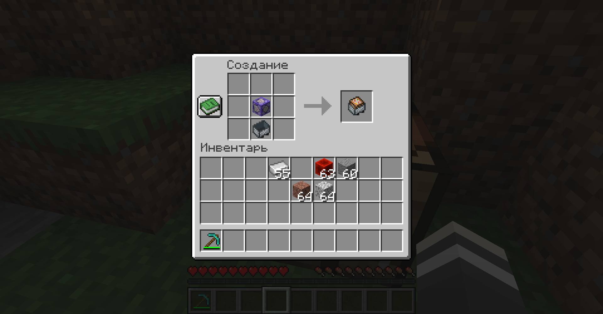

# Survival Command Blocks

*Command Blocks now made avalible and usable in a survival world near you!*

This mod (for Minecraft 1.20.2) makes command blocks craftable, placeable,
editable, and destroyable by players in survival mode, regardless of whether
they are an operator.

*Note: all players will recieve suggestions and auto-completion for all commands
on the server, but can only execute them if they are opped or are using a
command block.*

They can be crafted with 4 iron ingots, a redstone block, and 4 blocks of either
andesite, granite, or diorite for their respective command block (can also used
polished variants, and of course you can switch the type of a command block in
it's GUI.) View the screenshots for more information.

It is mainly intended to allow a survival playthrough with access to command
blocks similiar to Toy Box
(https://www.youtube.com/playlist?list=PLGyo0_Pda1ECwOAM2QwCLxU-L2uW_JtpJ) /
Survival Commanders
(https://www.youtube.com/playlist?list=PLaURolsKD_VEQ_W22mpaXYRZLWHC5bJpV), a
series by SimplySarc and Zedaph, and Survival Commander
(https://www.youtube.com/playlist?list=PLaURolsKD_VGoVCadwVdGqAdlWnTwoBdr) by
Zedaph. The idea is that you can use them to create mechanisms, special effects,
etc., but without cheating anything in that you did not obtain yourself (i.e. no
using /give or using /fill unless you've done something to pay for it, like
permanetly setting aside the equivalent blocks being filled inside a chest.) Of
course, play how you want ;).

*Note: if used on a dedicated server, the users will still need to install the
mod as well.*

## Configuration

The recipes are all located under the following identifiers if you wish to
change them using a datapack:

- Command Block - `minecraft:command_block`
- Chain Command Block - `minecraft:chain_command_block`
- Repeating Command Block - `minecraft:repeating_command_block`
- Command Block Minecart - `minecraft:command_block_minecart`

## Installation

You will need to use the Fabric Modloader (https://fabricmc.net/use/installer)
to use this mod.

You will also need to install the following dependency(ies):
- Fabric API - https://www.curseforge.com/minecraft/mc-mods/fabric-api

After that, grab a version from the releases tab
(https://github.com/ona-li-toki-e-jan-Epiphany-tawa-mi/Survival-Command-Blocks/releases)
and simply place it inside your mods folder.

## How to build

Java 17 or higher is required.

First, follow these instructions on the Fabric Wiki to get the development
enviroment setup: https://fabricmc.net/wiki/tutorial:setup

After that, run the following command inside the project directory:

```console
./gradlew build
```

If on Windows instead of a POSIX system, run this instead:

```console
gradlew.bat build
```

The complied jar file should appear in build/libs/.

## Links

Demonstration video:<br>
https://odysee.com/Command-Blocks-in-Survival-Minecraft:783b4b9b4a0bb4f00f437fe6b7ee79e8075121a1?r=HYroMZaqrVN4gL5oSJ35gcTgt3K56r39

## Screenshots








# Changelog

- Updated to 1.20.2
