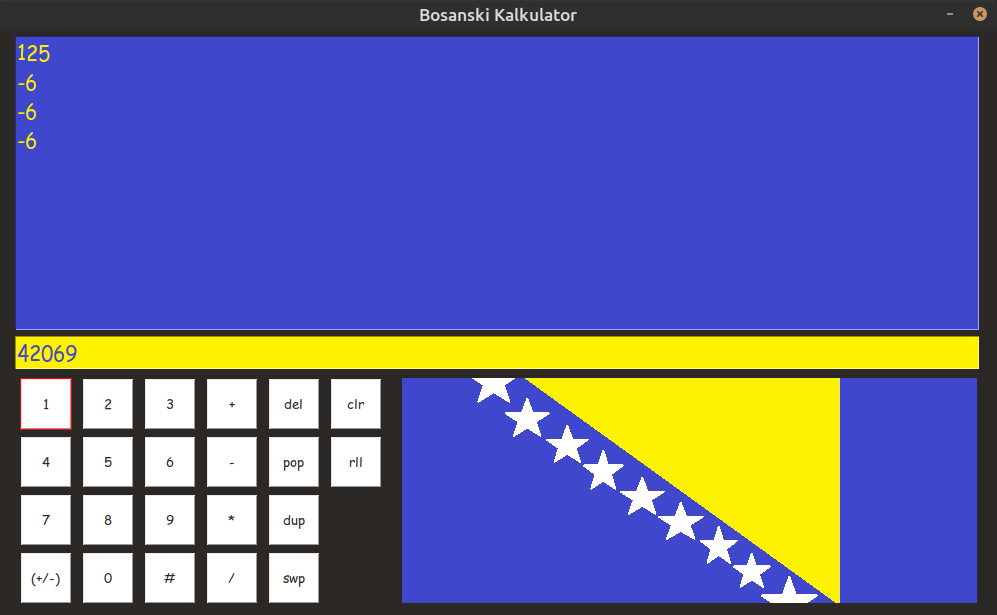

# Bosanski Kalkulator

A perfectly normal GUI stack-based calculator.

To enter a number, press the corresponding digits from left to right and finish by pressing the hashtag, which places it on the stack. You can optionally use `(+/-)` to toggle between entering positive and negative numbers.

The arithmetic operators use the 2 top values and returns the result onto the stack.

- `del` clears the typing area.
- `clr` clears the stack.
- `pop` removes the topmost value from the stack.
- `dup` duplicates the value on top of the stack.
- `swp` swaps the first two values on the stack.
- `rll` takes the value from the top of the stack and places it onto the bottom.

## How to build

Run the following commands in the project directory:

```console
python3 -m build
```

The built packages will appear in [dist/.](dist "Distributables folder.")

## Installation

Bosanski Kalkulator is avalible on [PyPi,](https://pypi.org/project/bosanski-kalkulator "Bosanski Kalkulator on PyPi") and can be installed by running the following command(s):

```console
pip install bosanski-kalkulator
```

Alternatively, you can download the latest package from [Releases,](https://github.com/ona-li-toki-e-jan-Epiphany-tawa-mi/Bosanski-Kalkulator/releases "Bosanski Kalkulator releases.") or build from source, and install it using the following command(s):

```console
pip install <package name goes here>
```

## How to run

[Python 3](https://www.python.org "Python homepage") is required.

If Bosanski Kalkulator was installed via package, simply run the following command(s):

```console
kalkulator
```

Alternatively, you can run it using the source code in the project folder.

The following dependencies are required:

- PySimpleGUI - \<https://pypi.org/project/PySimpleGUI>
- playsound - \<https://pypi.org/project/playsound>

Which can be installed using the following command(s):
```console
pip install PySimpleGUI playsound
```

Then the [main script](src/bosanski_kalkulator/main.py "main.py") can then be run using either of the following commands in the project directory:
```console
python3 src/bosanski_kalkulator/main.py
./src/bosanski_kalkulator/main.py
```

## Credits

The audio file [bosanska_artiljerija.mp3] was pulled from [Bosnian Folk Song - Bosanska Artiljerija](bosanska_artiljerija.mp3 "Bosnian Folk Song - Bosanska Artiljerija") on YouTube by [Folk Songs International,](https://www.youtube.com/@FolkSongsInternational "Folk Songs International's YouTube channel") make sure to check out their channel!
