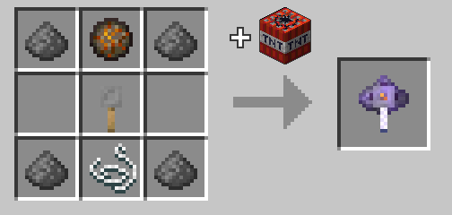

# Blow Chest Trap

The blow chest trap is a prank item that can be used to make chests explode when opened.

## Usage

Place the blow chest trap inside a compatible container, which would be one of the following:

- Chest.
- Trapped chest.
- Barrel.
- Shulker box.

Upon opening the container, it will explode, and itself and any items inside will be dropped on the ground. This explosion causes no damage to blocks or entities, so all the items will be preserved. The blow chest trap will be consumed in the process.

You can open a blow-trapped container safely by holding a pair of shears in your main hand.

## Crafting

Crafted in the [Combustion Forge.](combustion_forge "The Combustion Forge wiki page") Shaped recipe.



Crafted using 4x Gunpowder, 1x Tripwire Hook, 1x String, and 1x Fire Charge.

## Give Command

```mcfunction
/function xplsvtlts:blow_chest/give_trap
```