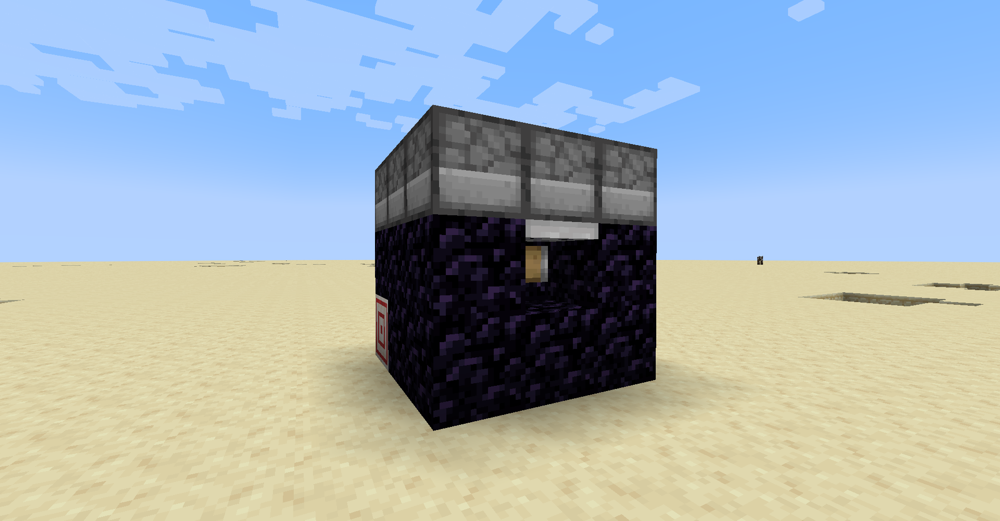

# Combustion Forge

The combustion forge is a multiblock crafting machine that utilizes explosions in order to combine items together. It provides a means of crafting the higher tier items from Explosive Utilities. It also provides some utility recipes that you might find convienent.

## Assembly

To create the combustion forge, you will first need to craft a [combustion forge core.](combustion_forge_core "Combustion Forge Core wiki page")

In addition to the core, you will need the following items:
- 13x Obsidian.
- 9x Furnace.
- 2x Target.
- 1x Dispenser.
- 1x Iron Trapdoor.

Place down the core where you would like to put the forge. Note that it is a 3x3x3 multiblock with the core as it's center.

After up to 10 seconds, the core will display a projection of where to place the blocks at. If any blocks are in the way, a red border will be shown around them. It will look something like this:

Make special note of the placement of the following blocks:
- The iron trapdoor: must be placed on the top of the block. Must also be placed facing away from the forge so that, when it closes, it is flush with the outside of the forge.
- The dispenser: must be placed facing into the forge.
- The furnaces: the orientation of the furnaces does not matter, but it looks nicer if you face the furnaces towards the center of the forge so that their front faces are not visible.

Once the structure is complete, some particles and a sound effect will alert you. It should look something like this:

A similar A/V effect will occur when you break the multiblock.

## Usage

The forge requires tnt as fuel, requiring 1 tnt per activation, which can be fed in through the rear dispenser.

The ingredients in the crafting recipe are to be placed inside the top slot of the furnaces. The furnaces form a 3x3 crafting grid much like in the crafting table. The bottom of the grid lies at the front of the forge, and, conversely, the top lies at the back. 

To activate, assuming it has fuel, close the trapdoor with a redstone signal. While running, the forge will make various sounds and output a redstone signal from the left target block. 

Once the forge is finished and ready to output the result, the sounds will stop and a redstone signal will outputted from the right target block.

To finish the recipe, open the trapdoor once the forge is done. If the trapdoor is opened prior, the items will simply be ejected and no crafting will take place. Note that the resulting explosion will hurt you, especially if you are in front of the forge.

The forge will attempt to make up to 16 items of the specified recipe. Any leftover items in the crafting grid will be ejected from the forge along with the crafted items.

## Utility Recipes

The recipes for the higher tier items are listed within their wiki page. The following are the various utility recipes that the forge provides (no images cuz fuck that b-b-bullshiiiit):

### Misc.

- (Shapeless) 2x Sand + 2x Gunpowder -> 1x Tnt.

### Pulverization

- (Shapeless) 1x Cobblestone or Blackstone or Cobbled Deepslate -> 1x Gravel.
- (Shapeless) 1x Gravel -> 1x Sand.
---
- (Shapeless) 1x Bone -> 5x Bone Meal + 30% chance of 2x Bone Meal + 5% chance of 2x Bone Meal.
---
- (Shapeless) 1x Blaze Rod -> 3x Blaze Powder + 10% chance of 1x Blaze Powder + 5% chance of 1x Blaze Powder.

### Compression/Decompression

- (Shaped) Where: C is Coal. Yields 1x Coal Block.
  - CCC CCC CCC
- (Shapeless) 1x Coal Block -> 9x Coal.
---
- (Shaped) Where: R is Raw Copper. Yields 1x Raw Copper Block.
  - RRR RRR RRR
- (Shapeless) 1x Raw Copper Block -> 9x Raw Copper.
---
- (Shaped) Where: C is Copper Ingot. Yields 1x Copper Block.
  - CCC CCC CCC
- (Shapeless) 1x Copper Block or Waxed Copper Block -> 9x Copper Ingot.
---
- (Shaped) Where: R is Raw Iron. Yields 1x Raw Iron Block.
  - RRR RRR RRR
- (Shapeless) 1x Raw Iron Block -> 9x Raw Iron.
---
- (Shaped) Where: I is Iron Ingot. Yields 1x Iron Block.
  - III III III
- (Shapeless) 1x Iron Block -> 9x Iron Ingot.
- (Shaped) Where: I is Iron Nugget. Yields 1x Iron Ingot.
  - III III III
- (Shapeless) 1x Iron Ingot -> 9x Iron Nugget.
---
- (Shaped) Where: R is Raw Gold. Yields 1x Raw Gold Block.
  - RRR RRR RRR
- (Shapeless) 1x Raw Gold Block -> 9x Raw Gold.
---
- (Shaped) Where: G is Gold Ingot. Yields 1x Gold Block.
  - GGG GGG GGG
- (Shapeless) 1x Gold Block -> 9x Gold Ingot.
- (Shaped) Where: G is Gold Nugget. Yields 1x Gold Ingot.
  - GGG GGG GGG
- (Shapeless) 1x Gold Ingot -> 9x Gold Nugget.
---
- (Shaped) Where: R is Redstone Dust. Yields 1x Redstone Block.
  - RRR RRR RRR
- (Shapeless) 1x Redstone Block -> 9x Redstone Dust.
---
- (Shaped) Where: L is Lapis Lazuli. Yields 1x Lapis Block.
  - LLL LLL LLL
- (Shapeless) 1x Lapis Block -> 9x Lapis Lazuli.
---
- (Shaped) Where: D is Diamond. Yields 1x Diamond Block.
  - DDD DDD DDD
- (Shapeless) 1x Diamond Block -> 9x Diamond.
---
- (Shaped) Where: E is Emerald. Yields 1x Emerald Block.
  - EEE EEE EEE
- (Shapeless) 1x Emerald Block -> 9x Emerald.
---
- (Shaped) Where: A is Amethyst Shard. Yields 1x Amethyst Block.
  - AA AA
- (Shapeless) 1x Amethyst Block -> 4x Amethyst Shard.
---
- (Shaped) Where: Q is Nether Quartz. Yields 1x Quartz Block.
  - QQ QQ
- (Shapeless) 1x Quartz Block -> 4x Nether Quartz.
---
- (Shaped) Where: G is Glowstone Dust. Yields 1x Glowstone.
  - GG GG
- (Shapeless) 1x Glowstone -> 4x Glowstone Dust.
---
- (Shaped) Where: N is Netherite Ingot. Yields 1x Netherite Block.
  - NNN NNN NNN
- (Shapeless) 1x Netherite Block -> 9x Netherite Ingot.
---
- (Shaped) Where: C is Clay Ball. Yields 1x Clay.
  - CC CC
- (Shapeless) 1x Clay -> 4x Clay Ball.
---
- (Shaped) Where: B is Brick. Yields 1x Bricks.
  - BB BB
- (Shapeless) 1x Bricks -> 4x Brick.
---
- (Shaped) Where: N is Nether Brick. Yields 1x Nether Bricks.
  - NN NN
- (Shapeless) 1x Nether Bricks -> 4x Nether Brick.
---
- (Shaped) Where: B is Bone Meal. Yields 1x Bone Block.
  - BBB BBB BBB
- (Shapeless) 1x Bone Block -> 9x Bone Meal.
---
- (Shaped) Where: P is Prismarine Shard. Yields 1x Prismarine.
  - PP PP
- (Shapeless) 1x Prismarine -> 4x Prismarine.
- (Shaped) Where: P is Prismarine Shard. Yields 1x Prismarine Bricks.
  - PPP PPP PPP
- (Shapeless) 1x Prismarine Bricks -> 9x Prismarine.
