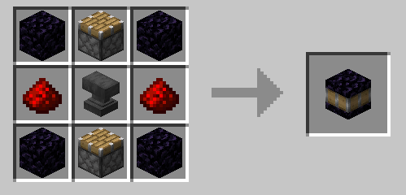

# Combustion Forge Core

The core block of the [combustion forge multiblock.](combustion_forge "The Combustion Forge wiki page")

## Usage

The core will have a description detailing various bits of information about the combustion forge.

Upon placing it on the ground, within 10 seconds, the core will display a projection of the required blocks to form the forge. Any blocks in the way will be marked with a red border.

You can place the core in 8 possible directions, but the forge can only face the 4 cardinal directions, so the core will be rotated if neccessary.

To pick it back up, go near it and crouch. This may take up to a second to work.

See further details in the [combustion forge's wiki page.](combustion_forge "The Combustion Forge wiki page")

## Recipe

Crafted in the Crafting Table.



Crafted using 4 obsidian, 2 redstone, 2 pistons, and an anvil.

## Give command

```mcfunction
/function xplsvtlts:combustion_forge/on_craft
```

