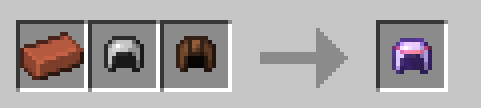
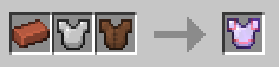
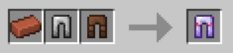
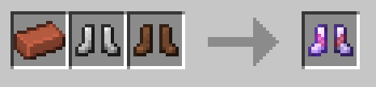

# Composite Armor

Composite armor is a cheap, blast resistant set of armor.

Each piece has Protection I and Blast Protection II.

## Recipes

Crafted in the Smithing Table.

- Helmet:



Crafted using an iron helmet, leather helmet, and brick.

- Chestplate:



Crafted using an iron chestplate, leather chestplate, and brick.

- Leggings:



Crafted using iron leggings, leather leggings, and a brick.

- Boots:



Crafted using iron boots, leather boots, and a brick.

## Give Commands

- Helmet:

```mcfunction
/function xplsvtlts:composite_armor/on_craft_helmet
```

- Chestplate:

```mcfunction
/function xplsvtlts:composite_armor/on_craft_chestplate
```

- Leggings:

```mcfunction
/function xplsvtlts:composite_armor/on_craft_leggings
```

- Boots:

```mcfunction
/function xplsvtlts:composite_armor/on_craft_boots
```