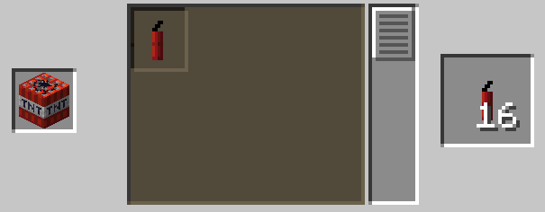

# Dynamite

A weak, throwable explosive.

## Usage

Hold the dynamite in your mainhand and flint and steel in your offhand. Right-click to light and throw a stick of dynamite, which will explode 60 ticks later.

Fun fact: there is a real life thing called dynamite fishing. You use an explosive charge to stun and kill fish so that they float to the surface. By throwing a stick of dynamite in water, there is a 40% chance to fish something out! [^1]

[^1]: Note: I do not recommend doing this in real life. Dynamite fishing causes major damage to ecosystems, is extremly ineffecient (only a couple fish in the explosion will float up, rest will sink due to air bladder getting blasted,) and straight up illegal in parts of the world! (pretty rad tho ngl.)

## Recipe

Crafted in the Stonecutter.



Crafted using tnt, may explode. 

## Give Command

```mcfunction
/function xplsvtlts:dynamite/give
```

## Configuration

You can set the fuse length of dynamite with this command, defaults to 60:

```mcfunction
/scoreboard players set dynamite_fuse_time xplsvtlts <ticks>
```
