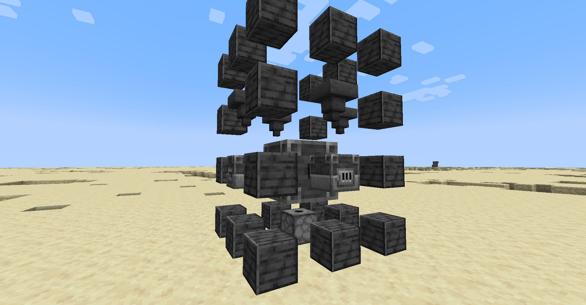
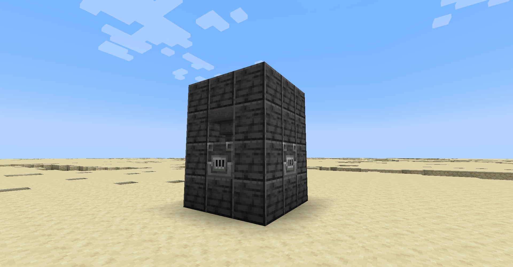

# Pistol Kiln

The pistol kiln is a multiblock smelter that uses gunpowder as fuel and smelts up to 4 stacks at a time. 

## Assembly

To create the pistol kiln, you will first need to craft a [pistol kiln core.](pistol_kiln_core "Pistol Kiln Core wiki page")

In addition to the core, you will need the following items:
- 24-32x Polished Deepslate or Deepslate Bricks or Deepslate Tiles.
- 0-4x Blast Furnace.
- 0-4x Hopper.
- 1x Dispenser.

The variable block counts are due to the blast furnaces and hoppers in the multiblock being optional, and can be replaced with one of the deepslate blocks listed above. You can have 1-4 furnaces with or without hoppers. And if you really wanted to, you could place no furnaces into it, though it wouldn't do anything then.

Place down the core where you would like to put the kiln. Note that it is a 3x4x3 multiblock with the core at the center of the second layer.

After up to 10 seconds, the core will display a projection of where to place the blocks at. If any blocks are in the way, a red border will be shown around them. It will look something like this:



Make special note of the placement of the following blocks:
- The blast furnaces must be placed facing out and and away from the kiln.
- The hoppers must be placed facing down into the blast furnaces.
- The dispenser must be placed facing up into the kiln.

Once the structure is complete, some particles and a sound effect will alert you. It should look something like this:



A similar A/V effect will occur when you break the multiblock.

## Usage

The kiln requires gunpowder as fuel, fed through the dispenser in the bottom. Each piece of gunpowder burns for 800 ticks, and each operation takes 9000 ticks, consuming a total of 11.25 gunpowder per operation.

The items to smelt are to be placed inside the top slot of the furnaces. Note that, while they are blast furnaces, the kiln is not restricted and will smelt anything that has a recipe.

Once items are placed in the furnaces, and the kiln has fuel, it will start runing, evidenced by a thick smog coming from the top of the kiln and light from the input furnaces. If the kiln runs out of fuel, or the items are removed, the kiln will slowly reverse it's progress until it goes back into idle mode. Note that the kiln will not check to see if an item is smeltable, placing non-smeltable items in will just waste fuel.

Take care not to fall into the kiln, as it will cook you, and anything else, alive.

Once the kiln is finished smelting, the smelted items will be fired out the top of the kiln. How to collect those items is an exercise left to the reader. Note: do not stand in the way of the kiln when it fires, there is a reason it is called a "pistol" kiln.

## Configuration

You can set how long it takes the pistol kiln to smelt items with the following command, defaults to 9000:

```mcfunction
/scoreboard players set pistol_kiln_runtime xplsvtlts <ticks>
```

You can set how long each piece of gunpowder will burn for in the pistol kiln with the following command, defaults to 800:

```mcfunction
/scoreboard players set pistol_kiln_gunpowder_fuel_time xplsvtlts <ticks>
```