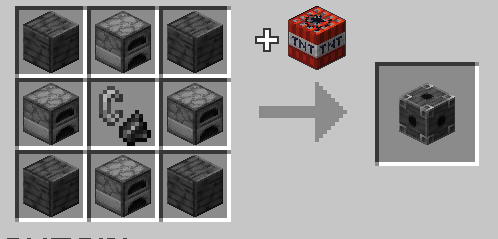

# Pistol Kiln Core

The core block of the [pistol kiln multiblock.](pistol_kiln "Pistol Kiln wiki page")

## Usage

The core will have a description detailing various bits of information about the pistol kiln.

Upon placing it on the ground, within 10 seconds, the core will display a projection of the required blocks to form the kiln. Any blocks in the way will be marked with a red border.

You can place the core on a 45 degree angle to the block grid, but it will be aligned automatically after a while.

To pick it back up, go near it and crouch. This may take up to a second to work.

See further details in the [pistol kiln's wiki page.](pistol_kiln "Pistol Kiln wiki page")

## Recipe

Crafted in the [Combustion Forge.](combustion_forge "The Combustion Forge wiki page") Shaped recipe.



Crafted using 4x Polished Deepslate or Deepslate Bricks or Deepslate Tiles, 4x Furnace, and 1x Flint and Steel.

## Give command

```mcfunction
/function xplsvtlts:pistol_kiln/give
```

