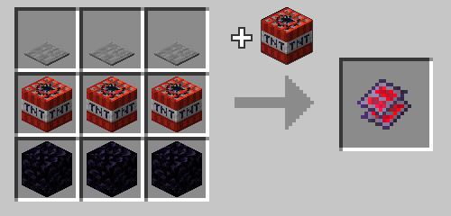

# Reactive Plating

An upgrade for your equipment that adds an explosive touch in exchange for added durability use. 

## Usage

You can apply the plating to an equipment item by tossing them together on an anvil (note: will use up anvil over time.)

Upon the equipment item being used for one of it's purposes, an explosion will be created as a result. You will be protected from damage by the reactive explosions, but it will eat through any armor you are wearing.

The following items can be upgraded:

| Item | Effect |
|------|--------|
| Swords, pickaxes, shovels, hoes, and axes | Will detonate when attacking entities, stripping blocks, tilling soil, making dirt paths, etc.. [^1] |
| Shears | Will detonate when shearing sheep, mooshrooms, etc.. |
| Armor | Will detonate in reaction to taking non-explosive damage from entities.<br><br>Has a default cooldown of 120 ticks divided by the number of armor pieces you are wearing with the upgrade, for a minimum cooldown of 30 ticks. Wearing all 4 pieces will greatly increase the power of the explosion.<br><br>Additionally, upgrading an armor piece with reactive plating will give it blast protection IV if blast protection is not already present on the armor piece, no repair costs involved. |
| Trident | Will detonate when attacking, similar to the tool items, but will also detonate on the first thing it comes into contact with when thrown. |
| Shield | Will detonate when blocking non-explosive damage.<br><br>Additionally, if you are crouching, it can consume 1 gunpowder from your inventory to create a larger explosion.|

[^1]: I intend to also make them detonate when mining blocks, but I've yet to find a reliable method of general block break detection.

## Recipe

Crafted in the [Combustion Forge.](combustion_forge "The Combustion Forge wiki page") Shaped recipe.



Crafted using 3 obsidian, 3 tnt, and 3 pressure plates of any kind.

## Give Command
```mcfunction
/function xplsvtlts:reactive_plating/give
```

## Make Reactive Command

Makes the held item reactive, if applicable.

```mcfunction
/function xplsvtlts:reactive_plating/make_held_item_reactive
```

## Configuration

You can set the base cooldown for the reactive armor with this command, defaults to 120:

```mcfunction
/scoreboard players set reactive_armor_maximum_cooldown xplsvtlts <ticks>
```