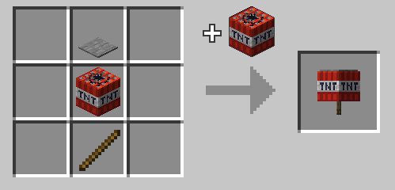

# Tnt on a Stick

Slapping together a stick, tnt, and a pressure plate creates a highly volatile weapon. Use is not recommended for those who enjoy living.

## Usage

Prep yourself for the coming sweet embrace of death and hit a living or non-living target with the tnt on a stick. 

You will find that, generally, the target will no longer exist afterwards, nor will you.

## Recipe

Crafted in the [Combustion Forge.](combustion_forge "The Combustion Forge wiki page") Shaped recipe.



Crafting using a stick, tnt, and a pressure plate of any kind.

## Give Command

```mcfunction
/function xplsvtlts:tnt_on_a_stick/give
```