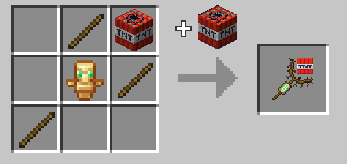

# Tnt Wand

The tnt wand is a magic weapon that allows you to manipulate tnt.

## Usage

### Summon Tnt

Right-clicking can consume a piece of tnt from your inventory to summon a lit tnt 4 blocks in front of you, even if that's inside a block. 

This has a cooldown of 40 ticks by default.

### Corraling

Holding right-click whilst looking at a lit tnt will allow you to corral it. It will follow your cursor and it's fuse will be frozen so it doesn't blow up in your face. 

This uses actual motion so you can build up momentum and lob around tnt with it. 

You can also do this with tnt minecarts and creepers, but just because you can, does not mean you should. Also with ghast fireballs, but you'll need to keep your cursor moving to keep control, lest you set yourself ablaze.

### Explosive Punch

Press left-click to create an explosion 1 block in front of you at the cost of 1 tnt. 

It is slightly less powerful than a normal explosion but has extreme knockback on non-player entities. 

Has a cooldown of 80 ticks by default. 

Damage from the explosion will be reduced by 80% for you.

### Tnt Cannon

Combining all three moves, you can create, aim, and launch a piece of tnt like a hand-held tnt cannon.

## Recipe

Crafted in the [Combustion Forge.](combustion_forge "The Combustion Forge wiki page") Shaped recipe.



Crafted using 3 stick, tnt, and a totem of undying.

## Give Command

```mcfunction
/function xplsvtlts:tnt_wand/give
```

## Configuration

You can set the summon cooldown for the tnt wand with this command, defaults to 40:

```mcfunction
/scoreboard players set tnt_wand_summon_cooldown xplsvtlts <ticks>
```

You can set the explosive punch cooldown for the tnt wand with this command, defaults to 80:

```mcfunction
/scoreboard players set tnt_wand_punch_cooldown xplsvtlts <ticks>
```

You can set whether to disable the corraling restrictions on the tnt wand with the following command. 1 to disable, 0 to enable, defaults to 0.

```mcfunction
/scoreboard players set disable_tnt_wand_corraling_restrictions xplsvtlts <1 or 0>
```

## Cross-Datapack Compatiblity

Tnt Wands can be used to corral mobs made explosive by [PigsThatGoBoomInTheNight.](https://www.planetminecraft.com/data-pack/pigsthatgoboominthenight "PigsThatGoBoomInTheNight on Planet Minecraft")

Tnt Wands can be used to corral bees if [Incendiary Bees](https://www.planetminecraft.com/data-pack/incendiary-bees "Incendiary Bees on Planet Minecraft") is installed.