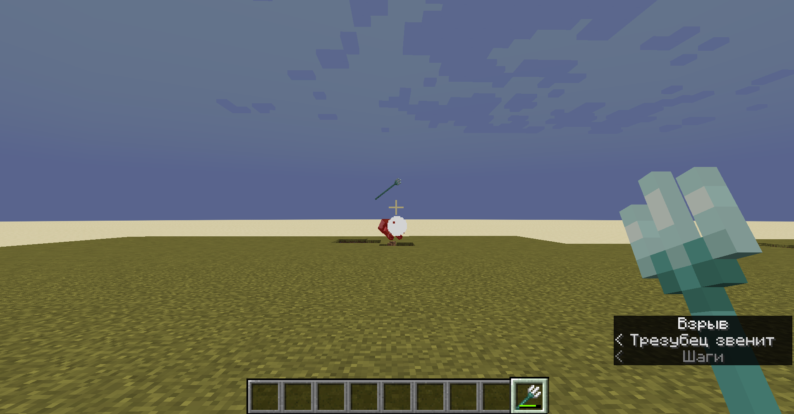

# Explosive Utilities

*Nitroglycerinomancology Reborn*

A data pack and resource pack for Minecraft 1.20+ that adds various explosive
tools to your world.

## What It Do?

To view the various additions made by explosive utilities, see the wiki
(https://github.com/ona-li-toki-e-jan-Epiphany-tawa-mi/Explosive-Utilities/wiki).

## Screenshots





## Installation

Download the resource and data pack folders from the git repository.

Place the resource pack inside your Minecraft installation's resource pack
folder and enable it. See for more information:
https://minecraft.fandom.com/wiki/Tutorials/Loading_a_resource_pack

Place the datapack inside your world's datapacks folder. See for more information:
https://minecraft.fandom.com/wiki/Tutorials/Installing_a_data_pack

The pack will automatically finish installation on world load, but you can force
it using (recommended if updating pack, note: resets configurations):

```mcfunction
/function xplsvtlts:install/initialize
```

## Uninstallation

To uninstall, you first need to run this command:

```mcfunction
/function xplsvtlts:install/uninstall
```

After that, remove the datapack from your world's datapacks folder before
reloading.

## Configuration

You can set the summon cooldown for the tnt wand with this command, defaults to
40:

```mcfunction
/scoreboard players set tnt_wand_summon_cooldown xplsvtlts <ticks>
```

You can set the explosive punch cooldown for the tnt wand with this command,
defaults to 80:

```mcfunction
/scoreboard players set tnt_wand_punch_cooldown xplsvtlts <ticks>
```

You can set whether to disable the corraling restrictions on the tnt wand with
the following command. 1 to disable, 0 to enable, defaults to 0.

```mcfunction
/scoreboard players set disable_tnt_wand_corraling_restrictions xplsvtlts <1 or 0>
```

You can set the base cooldown for the reactive armor with this command, defaults
to 120:

```mcfunction
/scoreboard players set reactive_armor_maximum_cooldown xplsvtlts <ticks>
```

You can set how long it takes the pistol kiln to smelt items with the following
command, defaults to 9000:

```mcfunction
/scoreboard players set pistol_kiln_runtime xplsvtlts <ticks>
```

You can set how long each piece of gunpowder will burn for in the pistol kiln
with the following command, defaults to 800:

```mcfunction
/scoreboard players set pistol_kiln_gunpowder_fuel_time xplsvtlts <ticks>
```

You can set the fuse length of dynamite with this command, defaults to 60:

```mcfunction
/scoreboard players set dynamite_fuse_time xplsvtlts <ticks>
```

## Links

- Explosive Utilities Wiki - https://github.com/ona-li-toki-e-jan-Epiphany-tawa-mi/Explosive-Utilities/wiki
- V0.2.0 Demonstration Video - https://odysee.com/@ona-li-toki-e-jan-Epiphany-tawa-mi:9/Explosive-Utilities-V0.2.0-Demo:4?r=HYroMZaqrVN4gL5oSJ35gcTgt3K56r39

## For Developers

To add recipes to the combustion forge multiblock, whether into this datapack,
or from your own datapack as an addon, see the tutorial in
`combustion_forge_recipes/README.md`.

## Release Notes

- Added combatiblity with Incendiary Bees to corral them with the tnt wand.
- Added visual and auditory cue for when the tnt wand's cooldowns are over.
- Added reactive plating and it's effects to various equiment items.
- Added tnt on a stick.
- ???.
- Optimizations, baby!
- Added config option to disable the entity restrictions on the tnt wand corraling ability.
- Moved minimum version to 1.20.
- Added combustion forge.
- Moved tnt wand recipe to require the combustion forge.
- Added pistol kiln.
- Added composite armor.
- Added dynamite.
- Added blow chest traps.

Make sure to run the following command if updating (note: resets configurations):

```mcfunction
/function xplsvtlts:install/initialize
```

Note: the CustomModelData number used for tnt wands has changed, making any preexisting ones malfunction. Either craft or give yourself a new one.
