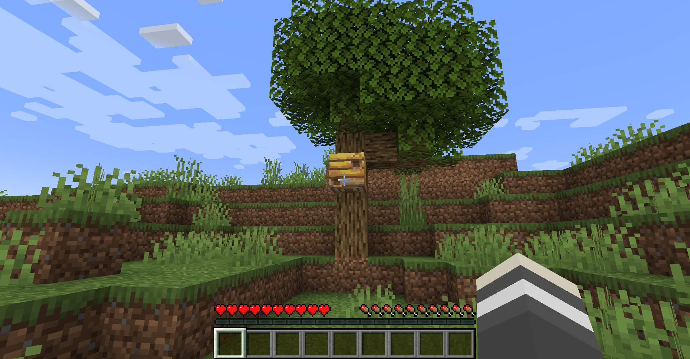
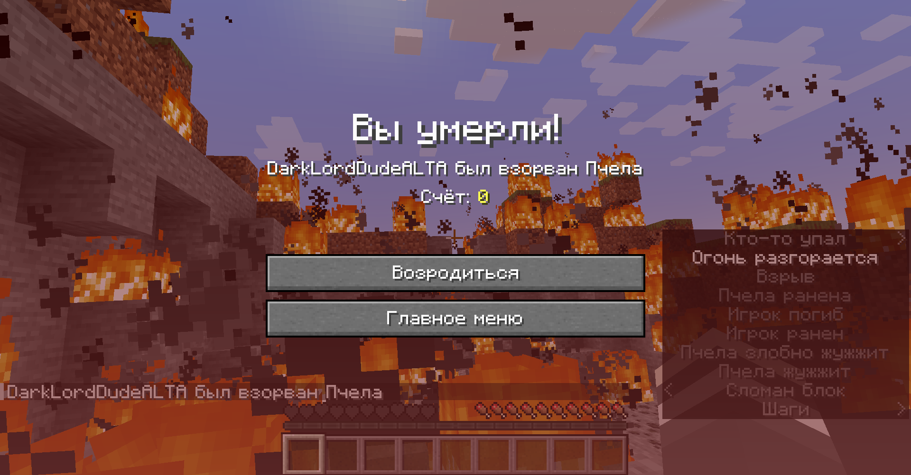

# Incendiary Bees

*High Ordinance Apioforms*

A data pack for Minecraft 1.19 (but will probably work with 1.15+) that causes
bees to ***carpet bomb*** your world when agitated!

## Screenshots




## Configuration

You can configure the amount of ticks between the dropping of each bee bomb with
the following command, defaults to 15:

```text
/scoreboard players set bee_bomb_cooldown incndrybs <ticks>
```

You can configure the bee bomb explosion power with the following command,
defaults to 10:

```text
/scoreboard players set bee_bomb_power incndrybs <explosion power>
```

## Installation

Download the data pack folder from the git repository and place it inside your
world's datapacks folder. See for more information:
https://minecraft.fandom.com/wiki/Tutorials/Installing_a_data_pack

The pack will automatically finish installation on world load, but you can force
it using (recommended if updating pack, note: resets configurations):

```text
/function incndrybs:install/initialize
```

## Uninstallation

To uninstall, you first need to run this command:

```text
/function incndrybs:install/uninstall
```

After that, remove the datapack from your world's datapacks folder before
reloading.

## Links

Demonstration video:<br>
https://odysee.com/Bees-Go-Boom:be3aee1d2306464c2c10a2d6c1a13224f4ec364d?r=HYroMZaqrVN4gL5oSJ35gcTgt3K56r39

## Changelog

- Fixed uninstall command displayed in installation message.
