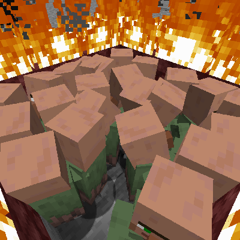

# Nitwit Only Mode

Ever wanted all the villagers in your world to be nitwits? No? Well, too bad!
Now they are.

A datapack for Minecraft 1.19 (but should work for 1.13+) that makes all
villagers useless nitwits.

## Installation

Download the data pack folder from the git repository and place it inside your
world's datapacks folder. See for more information:
https://minecraft.fandom.com/wiki/Tutorials/Installing_a_data_pack

## Uninstallation

To uninstall, remove the datapack from your world's datapacks folder and reload.

Note: villagers will **NOT** be reverted to their original profession nor will
their trades be restored.
